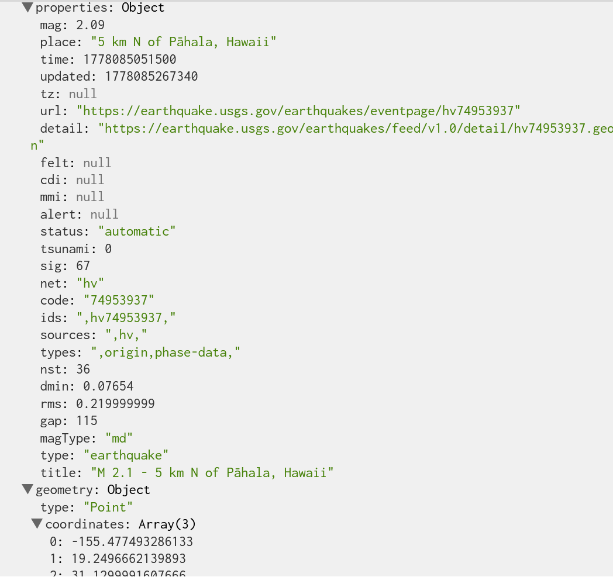

# 5/6/2026

Agenda:
- Check-in
- Evaluations (~15 mins)
- Where to go from here
- Exercise: final prep & pseudocode

---
### Check-in

- Questions about the final?
- **Please** keep presentations to 5 minutes, we'll have a lot to get through!

----
### Pseudocode

[Pseudocode](https://www.cs.uwyo.edu/~nfrazie1/cosc1030/pseudocode.pdf) is a high-level tool for thinking through the programs you plan on writing. There are no hard and fast rules for how to write it: some people prefer to use keywords, while others prefer using entirely plain language, but the key is that you be *consistent* in how you write it (if you're using keywords or things that resemble programming languages, use the same ones every time) and *thorough*: if you keep iterating on your pseudocode until you have a description of all the parts of your program you know how to do, it helps clarify what you still need to figure out.

As an example, let's take a classic [bouncing ball sketch](https://editor.p5js.org/icm/sketches/BJKWv5Tn). First I'll describe the big things I want:
1. Draw a ball
2. Make it move
3. When it hits the edge of the canvas, make it bounce

We'll keep the standard p5 wrapper functions, but use pseudocode inside and outside of them to *describe* what we want first. 

Then we set up our sketch (I like to use ALL CAPS when I'm describing a verb and not using the actual code, but you don't have to). Obviously I know I need a canvas:
```
function setup() {
	DRAW canvas
}
```

Then we describe what we want the sketch to actually do. The important thing here is I'm describing the logic without worrying about *how it's implemented*: I just want to make sure I know what I want the sketch to look like. I need to draw the circle, make sure it's moving, and make sure it bounces:

```
function draw() {
	DRAW background
	DRAW circle at starting X and starting Y with radius
	ADD movement speed to X
	ADD movement speed to Y
	IF circle X is greater than canvas width or less than zero:
		circle should bounce
	
	IF circle Y is greater than canvas height or less than zero:
		circle should bounce
}
```

Once I've written out the pseudocode, it's good to go through and think about what can be included in the structure - in our case, it's nice to store movement speed, starting X, and radius in variables, so I can go back to the top of the sketch and do that.

 ```
// globals
let starting X
let starting Y
let X speed
let Y speed
let radius
 ```

And think about what I haven't described mechanically yet - in this case, how will it bounce? To bounce off of a wall, we want it to go in the opposite direction, so I can say, instead of `circle should bounce`, `bounce circle: multiply speed by -1 (to change direction)`

This can be a very helpful tool before writing your code: even if you're just googling or asking AI for help, you can get much clearer answers once you've written out pseudocode and have phrased exactly what you want. The bouncing ball sketch is a simple example, but it gets exponentially more helpful with complex tasks. Say I want to build the [earthquake example](https://editor.p5js.org/brondle/sketches/kf3IPpvxX) from last week. I know I have a really complex object to work with:



But I can make the process of thinking through this pretty simple with pseudocode. 
It helps to start with the big goals and break them down into steps.

1. Get data from the USGS earthquake API
2. Access the important stuff (in our case, coordinates and magnitude)
3. Draw a map on the canvas
4. Draw our earthquakes on the map, showing magnitude somehow

So let's start with 1:
```
function preload() {
// i know i have to call any load() functions in preload
- LOAD JSON from API and save it in a variable
}
```

Once we've loaded it, we should be able to access it in setup and store it:
```
function setup() {
- WHEN JSON has loaded:
	- FOR each quake in the earthquake data:
	  - GET latitude, longitude, and magnitude
	  - PUSH these to an array
}
```

We can add a global variable to the top of our sketch since we know we'll want to store this data:
```
LET earthquakes (-an array where each object has latitude, longitude, and magnitude)
```
Now we can go to 3 - we know we need to load an image of a map, so we can add this to preload:
```
- LOAD image of map and save it in a variable
```

And then we need to draw that in our draw loop:
```
function draw() {
	DRAW world map image as background 
}
```

Now let's try drawing our earthquakes:
```
FOR each quake in earthquakes:
	DRAW dot at latitude and longitude
```

So now we've got a super simple breakdown of what we want our sketch to be:
```
LET earthquakes (an array where each object has latitude, longitude, and magnitude)
LET map (variable to store image of world map)

function preload() {
// i know i have to call any load() functions in preload
- LOAD JSON from API and save it in a variable
- LOAD image of map and save it in a variable

}

function setup() {
- WHEN JSON has loaded:
	- FOR each quake in the earthquake data:
	  - GET latitude, longitude, and magnitude
	  - PUSH these to an array
}

function draw() {
	DRAW world map image as background 
	FOR each quake in earthquakes:
		SET fill color based on magnitude
		DRAW circle at latitude and longitude
}

```

The trick is to keep iterating to describe in closer detail: for example, I could go deeper on setting color:
```
	LET fill color equal map(blue (low magnitude) to red (high magnitude))
```

Or drawing the circle in a more earthquake-y way:
```
DRAW dot at latitude and longitude
LET pulse = (variable to increase and decrease outer circle - could use sin wave?)
MULTIPLY pulse by magnitude (bigger pulses for bigger earthquakes)
DRAW ripple based on pulse size 
```

And I could keep breaking those down even further as I think through the logic.

---
### Exercise

In your text editor of choice - you can even use the p5 editor - write down:

1. The library or project you're working on for your final
2. A few sentences explaining what it is and why you chose it
3. Pseudocode your demo. Start by writing out the big steps, then break each of them down into smaller steps and programmatic elements. So if I'm working with ml5.js and I want to take a picture every time the user gives a thumbs up, I'd start with:
	1. Load ml5 and camera
	2. Run ml5 model on camera feed
	3. Isolate fingers
	4. IF user is giving a thumbs up, take a picture

Then think through the smaller steps for each piece (e.g. am I drawing the camera feed? How do I figure out if the user is giving a thumbs up?) and write pseudocode for that. Every time you get stuck on the logic, it's fine to just describe what you *want* to happen and come back to it later.

When you're done, make note of what parts you're still not sure about - bold or highlight sections where you can't figure out how to break it down any further. 

Once you've submitted the exercise, you may leave class to work on your final or stay to ask me questions - raise a hand or message me in the chat.

---
## Useful Links

## For The Final

- [Using Libraries in p5.js](https://happycoding.io/tutorials/p5js/libraries)

### Tools & Frameworks
- [Processing](https://processing.org) - p5's predecessor, Java-based
- [TouchDesigner](https://derivative.ca) - node-based visual programming, free for non-commercial use
- [Arduino](https://www.arduino.cc) - physical computing platform
- [Raspberry Pi](https://www.raspberrypi.com) - small single-board computer, great for installations
- [Blender](https://www.blender.org) - free, open-source 3D modeling & animation
- [The Book of Shaders](https://thebookofshaders.com) - intro to GLSL shaders

### Game Engines
- [Godot](https://godotengine.org) - free, open-source, huge community
- [Unity](https://unity.com) - industry standard, free tier available
- [Unreal Engine](https://www.unrealengine.com) - industry standard, free for learning
- [itch.io](https://itch.io) - platform for publishing & discovering indie games

### Grad Schools
- [NYU ITP](https://tisch.nyu.edu/itp) - 2-year MPS, interdisciplinary
- [Hunter IMA MFA](https://ima-mfa.hunter.cuny.edu/) - MFA in Integrated Media Arts, right here at Hunter
- [Parsons Design & Technology MFA](https://www.newschool.edu/parsons/mfa-design-technology/)
- [MIT Media Lab](https://www.media.mit.edu) - research-focused, fully funded

### Communities in NYC
- [Wonderville](https://www.wonderville.nyc) - indie arcade & event space, Brooklyn
- [NYC Resistor](https://www.nycresistor.com) - hackerspace, Brooklyn
- [Recurse Center](https://www.recurse.com) - free self-directed programming retreat
- [Hex House](https://hexhouse.studio) - creative community space & workshops
- [NYC Creative Code](https://www.meetup.com/nyc-creative-code/) - meetup group

### Fellowships & Grants
- [Eyebeam](https://www.eyebeam.org) - art & technology residency/fellowship
- [Creative Capital](https://creative-capital.org) - grants for artists
- [Mozilla](https://www.mozilla.org/en-US/moss/) - open source support program
- [NEW INC](https://www.newmuseum.org/new-inc) - incubator at the New Museum